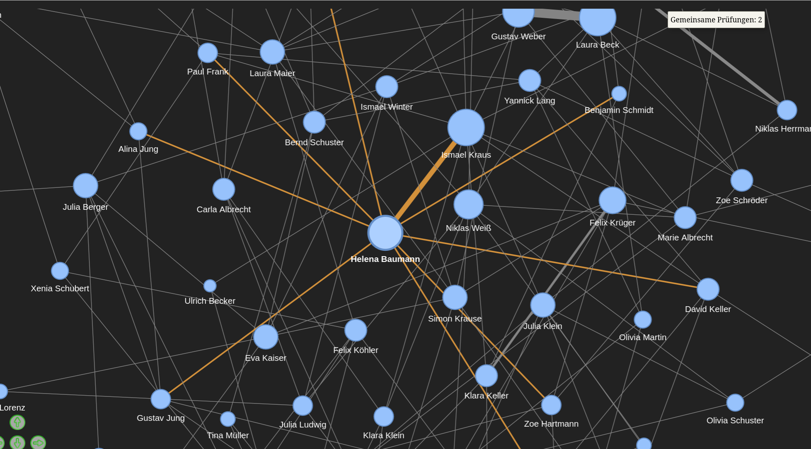
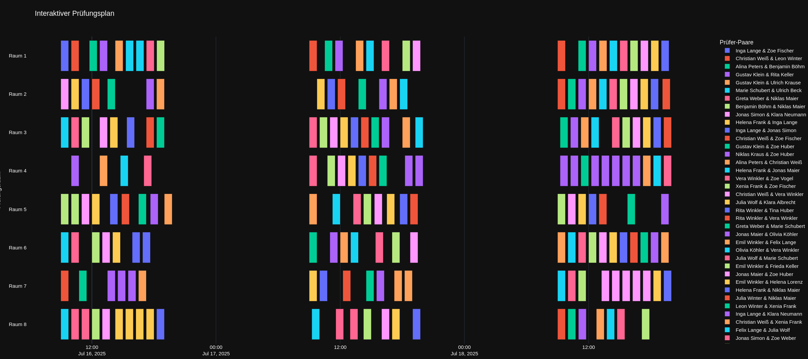

# Optimierungs-Tool für die Prüfungsplanung

Dieses Projekt bietet eine komplette Lösung zur Erstellung, Optimierung und Visualisierung von Prüfungsplänen (z.B. für Disputationen von Bachelor- oder Masterarbeiten). Es nutzt **Google OR-Tools**, einen mächtigen Constraint-Solver, um einen Plan zu erstellen, der eine Reihe von harten und weichen Randbedingungen erfüllt.

Das primäre Ziel ist es, den Verwaltungsaufwand zu minimieren und den Komfort für die beteiligten Professoren zu maximieren, indem ihre Prüfungsblöcke gebündelt werden.

## ✨ Features

-   **Dummy Daten Generierung:**
    -   **Parametrisierbare Datengenerierung:** Erzeugt realistische Dummy-Prüfungsdaten basierend auf einfachen Einstellungen in einer zentralen `config.yaml`-Datei.
    -   **Steuerbare Cluster-Erzeugung:** Ermöglicht das Testen durch gezielte Bildung von "Arbeitsgruppen" von Professoren mit einstellbarer Stärke und Varianz.
   
-   **Multi-Kriterien-Optimierung:** Der erstellte Plan ist nicht nur gültig, sondern optimiert auf:
    -   **Minimierung der Anwesenheitstage:** Professoren sollen an möglichst wenigen Tagen für Prüfungen eingeplant werden.
    -   **Bündelung von Prüferpaaren:** Prüfungen, die vom selben Professorenpaar abgenommen werden, werden bevorzugt direkt nacheinander und im selben Raum geplant.

-   **Umfassende Visualisierung:**
    -   **Auslastungsdiagramm:** Ein statisches Balkendiagramm zeigt die Prüfungsanzahl pro Professor.
    -   **Interaktives Netzwerkdiagramm:** Eine HTML-Visualisierung mit `pyvis`, die Cluster von Professoren durch räumliche Nähe aufdeckt. Inklusive Zoom, Panning und Klick-Hervorhebung.
    -   **Interaktives Gantt-Diagramm:** Eine HTML-Visualisierung des finalen Plans mit `plotly`. Jedes Prüferpaar hat eine eindeutige Farbe, um die Bündelung sofort sichtbar zu machen. Inklusive Zoom, Hover-Details und Filterung.

---

## 🚀 Installation & Einrichtung

### 1. Voraussetzungen

-   Python 3.7 oder neuer
-   pip (Python package installer)

### 2. Benötigte Dateien

Stellen Sie sicher, dass sich die folgenden vier Python- und Konfigurationsdateien im selben Verzeichnis befinden:

```
.
├── config.yaml
├── generate_data.py
├── optimize_schedule.py
└── visualize.py
```

### 3. Installation der Abhängigkeiten

Öffnen Sie ein Terminal oder eine Kommandozeile in Ihrem Projektverzeichnis und installieren Sie alle benötigten Python-Bibliotheken mit dem folgenden Befehl:

```bash
pip install -r requirements.txt
```

---

## ⚙️ Anwendung

Der Prozess besteht aus drei einfachen Schritten:

### Schritt 1: Konfiguration anpassen (optional)

Öffnen Sie die Datei `config.yaml` in einem Texteditor. Hier können Sie alle Rahmenbedingungen nach Ihren Wünschen anpassen.

**Wichtige Parameter:**
-   `num_students`, `num_professors`: Anzahl der Studierenden und Prüfer.
-   **`avg_joint_exams`**: Steuert die Größe der Professoren-Cluster (z.B. `4`).
-   **`cluster_strength`**: Steuert die "Varianz". Gibt an, wie viel Prozent der Prüfungen aus den gebildeten Clustern kommen sollen (z.B. `0.85` für 85%).
-   `num_days`, `num_rooms`: Verfügbare Tage und parallele Prüfungsräume.
-   `weight_active_days`, `weight_prof_pair_locality`: Gewichtung der Optimierungsziele.

### Schritt 2: Dummy-Daten erzeugen und analysieren

Führen Sie das Skript zur Datengenerierung aus. Es liest die Konfiguration, erzeugt die Prüfungsdaten und die Analyse-Visualisierungen.

```bash
python generate_data.py
```
**Beispiel der Professoren Paare:**



**Erzeugte Dateien:**
-   `pruefungsdaten.csv`: Eine Tabelle mit allen Prüfungen und den zugewiesenen Prüfern.
-   `professoren_auslastung.png`: Statisches Balkendiagramm zur Auslastung.
-   `professoren_paare.html`: **Interaktives Netzwerkdiagramm. Öffnen Sie diese Datei in Ihrem Webbrowser!**

### Schritt 3: Prüfungsplan optimieren

Führen Sie nun das Optimierungsskript aus. Es lädt die erzeugten Daten, berechnet den bestmöglichen Plan und erstellt das finale interaktive Gantt-Diagramm. Während der Berechnung wird der Fortschritt in der Konsole angezeigt.

```bash
python optimize_schedule.py
```

Dieser Prozess kann je nach `solver_time_limit_seconds` in der Konfiguration einige Minuten dauern.

**Beispielhafter Auszug aus dem Plan:**
```bash
     Tag  Raum Startzeit          Student                  Prüfer 1                   Prüfer 2
164    1     1     09:00     Niklas Klein    Prof. Dr. Alina Franke     Prof. Dr. Olivia Maier
135    1     1     10:00    Yannick Simon    Prof. Dr. Felix Köhler   Prof. Dr. Xenia Schubert
139    1     1     11:00      Alina Klein   Prof. Dr. Ismael Lorenz  Prof. Dr. Niklas Herrmann
146    1     1     12:00       Simon Lang   Prof. Dr. Ismael Lorenz   Prof. Dr. Marie Albrecht
3      1     1     13:00        Tina Roth     Prof. Dr. Laura Maier    Prof. Dr. Simon Richter
112    1     1     14:00   Olivia Günther  Prof. Dr. Helena Baumann     Prof. Dr. Zoe Hartmann
77     1     1     15:00      Xenia Braun      Prof. Dr. Paul Frank   Prof. Dr. Xenia Schubert
138    1     1     16:00     David Berger   Prof. Dr. Gustav Krüger   Prof. Dr. Gustav Richter
24     1     1     17:00  Ulrich Schubert    Prof. Dr. Felix Köhler    Prof. Dr. Ulrich Krause
120    1     1     18:44      Alina Lange    Prof. Dr. Felix Köhler      Prof. Dr. Frieda Beck
```

**Beispiel einer möglichen Optimierung:**



**Erzeugte Dateien:**
-   `optimierter_pruefungsplan.csv`: Der finale Plan im CSV-Format.
-   `optimierter_plan_interaktiv.html`: **Das finale, interaktive Gantt-Diagramm. Öffnen Sie diese Datei in Ihrem Webbrowser!**

---

## 🛠️ Verwendete Technologien

-   **Python:** Die Programmiersprache des Projekts.
-   **Google OR-Tools (CP-SAT):** Das Herzstück der Optimierung.
-   **Pandas:** Für die Datenmanipulation.
-   **PyYAML:** Zum Einlesen der Konfiguration.
-   **Matplotlib:** Zur Erstellung des statischen Auslastungsdiagramms.
-   **Pyvis:** Zur Erstellung des interaktiven HTML-Netzwerkdiagramms.
-   **Plotly:** Zur Erstellung des interaktiven HTML-Gantt-Diagramms für den finalen Plan.